# Implementing Your Own Event Loop From Scratch

---

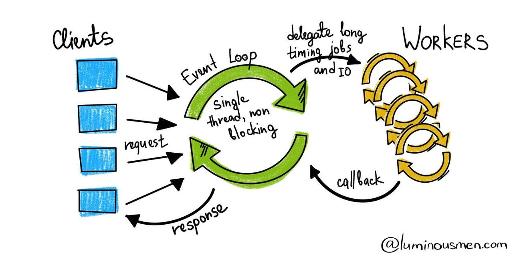

Hello Folks,

I've always wondered how an ***Event Loop*** works.

*"How does it accept a task? How does it delegate that task?"*

*"How does it continue accepting new tasks without pausing the execution of previously accepted tasks?"*

*"How does it know that a previous task has completed its execution and the result should be returned to the caller?"*

Given that the **Event Loop** sits at the core of languages such as `JavaScript` and non-blocking client server `Java` frameworks such as `Netty` that are widely used in our day-to-day development, I felt that it's essential to gain a first-hand understanding of its inner workings!

And, hence, I decided to implement an Event Loop from scratch in `Java!`

Here's how I went ahead with it...

I started with one of the core building blocks of an Event Loop: the `Event`:

By definition, an `Event` in a software system is an entity that denotes some sort of activity or a change in the system.

This change might be introduced due a user action or it might be  even triggered due a system activity that runs in the background (such as a CRON job).

Events that are produced by a system might be consumed (or processed) by the same system internally or relayed to an external system for further processing.

In either case, the event must contain sufficient information that enables its consumers to process it independently!

Hence, for the sake our implementation, we'll assume that an event holds the following fields:

```Java
public final class Event {
    public final String key;
    public final String data;
    public final boolean asynchronous;

    public Event(String key, String data, boolean asynchronous) {
        this.key = key;
        this.data = data;
        this.asynchronous = asynchronous;
    }
}
```

Looking at the above class, one might wonder what's the significance of the `asynchronous` field?

Usually, there's a single thread or a process (depending on implementation) backing an Event Loop, i.e., the code of the Event Loop is executed by this single thread or process.

> For the sake of simplicity and to avoid unnecessary repetition, we'll assume that a `thread` is roughly equivalent to a `process` and henceforth shall use the term `"thread"` alone.

We can call this thread as the `main` thread.

If this `main` thread were to accept & execute a task by itself, it would have to block before accepting a new task, thus resulting in reduced throughput.

Hence, instead of executing the task by itself, the main thread *"delegates"* the task to a `worker` thread.

If we assume that an event is generated for each such task, we can say that the event is processed `asynchronously`.

However, there might be certain tasks that are extremely `"lightweight"`, meaning executing these tasks won't consume much time, and hence, these could be executed `synchronously` by the `main` thread.

To represent such tasks, we need a `differentiator` in their events to treat them differently from the other tasks.

The `asynchronous` field in the `Event` class serves this purpose!

Now that we are clear with that, let's move ahead and implement the next building block (and probably the most important one), i.e., the `EventLoop`:

```Java
public class EventLoop {
    ...
}
```

Let's fill in all the details in the above class line by line...

As we know, an event loop doesn't execute all the tasks itself.

Instead, it delegates these to a `worker thread` that runs in the *background*.

But until that *delegation* happens the Event Loop needs to store these tasks somewhere.

And hence, it needs some sort of data structure to hold this data.

Let's declare a field called `events` that plays the role of an event store, like so:

```Java
public class EventLoop {
    private final Deque<Event> events;
}
```

For the sake of simplicity, we are assuming that the incoming tasks are prioritised for execution in a `"first come, first serve"` manner, and hence, the `events` field in the above class is of type `Deque`, which is a type of `Queue`.

Next, the Event Loop needs to know what code to execute in response to an event generated for a given task, i.e., it needs another data structure to `map` an event to its respective handler!

And the same can be done as shown in the following code snippet:

```Java
public class EventLoop {
    private final Deque<Event> events;
    private final Map<String, Function<String, String>> handlers;
}
```

The `handlers` field in the above code snippet is defined as a `Map` of `String` & `Function`, wherein the `String` serves as a unique identifier for an event and the `Function` holds the code that will serve as a `handler` (or a processor) for the said event.

Now that we know where to store the events and how to map them to their handlers, are we done here?

Certainly not!

Once the `event handlers` complete their execution, the results that they generate must be stored somewhere.

But why do we need separate storage for the results?

Why can't the results be sent directly to the `callers` who had submitted the tasks?

Remember that a majority of the tasks submitted to the Event Loop are executed `asynchronously` by worker threads that run in the background.

The sole job of these `worker threads` is to complete the tasks and send a `signal` to the `main` thread stating the same.

Now, what would be an effective way of *signalling* to the *main* thread that a given task is complete without making any sort of *blocking* call?

The answer is simple: Use another queue to store the results.

The *main* thread would be then periodically poll this queue to check for new results.

Let's do that by adding a new field called `‌processedEvents` to our `EventLoop` class as follows:

```Java
public class EventLoop {
    private final Deque<Event> events;
 
    private final Map<String, Function<String, String>> handlers;
 
    private final Deque<EventResult> processedEvents;
}
```

Now, let's add a default *constructor* to the above class to initialise all the fields mentioned above:

```Java
public class EventLoop {
    private final Deque<Event> events;
    private final Map<String, Function<String, String>> handlers;
    private final Deque<EventResult> processedEvents;

    EventLoop() {
        events = new ArrayDeque<>();
        handlers = new HashMap<>();
        processedEvents = new ArrayDeque<>();
    }
}
``` 

So far so good, now that we have all the data structures in place, let's think about *wiring* the events with their respective handlers.

Let's add a method to the above class that does this:

```Java
public class EventLoop {
    private final Deque<Event> events;
    private final Map<String, Function<String, String>> handlers;
    private final Deque<EventResult> processedEvents;

    EventLoop() {
        events = new ArrayDeque<>();
        handlers = new HashMap<>();
        processedEvents = new ArrayDeque<>();
    }

    public EventLoop on(String key, Function<String, String> handler) {
        handlers.put(key, handler);
        return this;
    }
}
```

The `on()` method in the above code populates the ***handlers***  fields with an identifier for a given event and the code that should be executed in response to that event.

Next, we need *schedule* the event for execution, and that can be done by adding another method `dispatch()` as shown below:

```Java
public class EventLoop {
    private final Deque<Event> events;
    private final Map<String, Function<String, String>> handlers;
    private final Deque<EventResult> processedEvents;

    EventLoop() {
        events = new ArrayDeque<>();
        handlers = new HashMap<>();
        processedEvents = new ArrayDeque<>();
    }

    public EventLoop on(String key, Function<String, String> handler) {
        handlers.put(key, handler);
        return this;
    }

    public void dispatch(Event event) {
        events.add(event);
    }
}
```

Okay, so now we have a neat looking class with all the essential fields and the code to populate those fields.

Will this be enough?

No, not really, we still need some code that will take each event and call its event handler to execute the task for which that event was generated.

So, let's create a method called `run()` to do that:

```Java
public void run() {

	Event event = events.poll();

	if (event != null) {
		System.out.printf("%nReceived Event: %s%n", event.key);

		if (handlers.containsKey(event.key)) {
			
			var startTime = Instant.now();

			if (event.asynchronous) {
				processAsynchronously(event);
			} else {
					processSynchronously(event);
			}

			var endTime = Instant.now();

			System.out.printf("%nEvent Loop was blocked for %s ms due to this operation %n%n",Duration.between(startTime, endTime).toMillis());
			
		} else {
				System.out.printf("No handler found for %s%n%n", event.key);
		}
	}
	
	var processedEvent = processedEvents.poll();
	
	if (processedEvent != null) {
		produceOutputFor(processedEvent);
	}
}
```

But what is this `run()` method doing exactly?

Let's dissect it line by line:

- The first thing that it needs to do is to check if there are any events that haven't been *"processed"* yet.

- And to do that, it uses the `pop()` method of the `events` field. This method removes the first event in the queue and returns it.

- It's possible that the `pop()` method might return nothing (`null`) if there are no *unprocessed* events, hence the `run()` method needs to ensure that it has retrieved a valid event before processing it further.

- If the retrieved event is valid, `run()` prints a message stating the same (useful for debugging purposes, of course).

- Next, it tries to find the `event handler` for the retrieved event in the `handlers` field.

- Once the `event handler` is found, `run()` needs to decide how to execute it: `synchronously` or `asynchronously`?

- To make this decision, it uses the `asynchronous` field of the event and invokes:
  - `processAsynchronously()` if `asynchronous` is set to `true`
  - `processSynchronously()` if `asynchronous` is set to `false`

- But what do these methods do? Let's have a look at their code:

```Java
private void processAsynchronously(Event event) {
    new Thread(() -> processedEvents.add(new EventResult(event.key, handlers.get(event.key).apply(event.data)))).start();
}

private void processSynchronously(Event event) {
    produceOutputFor(new EventResult(event.key, handlers.get(event.key).apply(event.data)));
}
```

- The `processAsynchronously()` method creates a new `worker` thread using the `Thread` class of `Java` and passes a `lambda` function (denoted by `() -> `) to it that acts a `runnable`, i.e., code that can be executed concurrently.

- And what does the `lambda` function do?

- Well, it creates a new instance of the `EventResult` class (which represents a *"processed event"*) using the event's unique identifier, i.e., `event.key` and the  value produced by the `event handler` mapped against the event and adds it to the list of `processedEvents`.

- The `processAsynchronously()` method then invokes the `start()` method of this newly created `Thread` to send a signal to the `Java Virtual Machine` that this thread needs to be executed without blocking the calling thread (in this case the `main` thread which is currently executing the code of the `processAsynchronously()` method).

- Here's a simplified version of the above code for better understanding:

```Java
new Thread(() -> {
	
	var eventHandler = handlers.get(event.key);
	
	var result = eventHandler.apply(event.data);
	
	var processedEvent = new EventResult(event.key, result);
	
	processedEvents.add(processedEvent);

}).start();
```

- In case you haven't noticed, the `event handler` is actually invoked using its `apply()` method, and the event's data is passed to it as an argument.

- But since this invocation happens inside the `lambda` that's passed to the new `Thread` instance, the `main` thread isn't blocked by it, and hence we can say that the event is processed ***"asynchronously!"***

- On the other hand, the `processSynchronously()` simply invokes another method, `produceOutputFor()` with a new instance of the `EventResult` class.

- And the `produceOutputFor()` simply prints the result of the processed event as illustrated below:

```Java
private void produceOutputFor(EventResult eventResult) {
	System.out.printf("%nOutput for Event %s : %s%n", eventResult.key, eventResult.result);
}
```

- However, unlike the `processAsynchronously()` method, since the `processSynchronously()` method invokes the `apply()` method of the `event handler` directly in the `main` thread, the code contained in the event handler and the code inside the `produceOutputFor()` is executed by the `main` thread only, thereby resulting in the **blocking** of the `main` thread.

- Hence, in this case, we can say that event is executed ***"synchronously!"***

Notice that we are capturing the `startTime` and `endTime` in the `run()` method above and then computing the difference between and printing it as follows:

```Java
System.out.printf("%nEvent Loop was blocked for %s ms due to this operation %n%n", Duration.between(startTime,endTime).toMillis());
```

We'll understand the importance of the above code once we start executing our `EventLoop`. Until then, let's move ahead...

This is what the final `EventLoop` class looks like with all the methods described so far:

```Java
package event.loop.demo;

import java.time.Duration;
import java.time.Instant;
import java.util.ArrayDeque;
import java.util.HashMap;
import java.util.Map;
import java.util.Deque;
import java.util.function.Function;

public class EventLoop {
    private final Deque<Event> events;
    private final Map<String, Function<String, String>> handlers;
    private final Deque<EventResult> processedEvents;

    EventLoop() {
        events = new ArrayDeque<>();
        handlers = new HashMap<>();
        processedEvents = new ArrayDeque<>();
    }

    public EventLoop on(String key, Function<String, String> handler) {
        handlers.put(key, handler);
        return this;
    }

    public void dispatch(Event event) {
        events.add(event);
    }

    public void run() {

        Event event = events.poll();

        if (event != null) {
            System.out.printf("%nReceived Event: %s%n", event.key);

            if (handlers.containsKey(event.key)) {
                var startTime = Instant.now();

                if (event.asynchronous) {
                    processAsynchronously(event);
                } else {
                    processSynchronously(event);
                }

                var endTime = Instant.now();

                System.out.printf("%nEvent Loop was blocked for %s ms due to this operation %n%n",
                        Duration.between(startTime, endTime).toMillis());
            } else {
                System.out.printf("No handler found for %s%n%n", event.key);
            }
        }

        var processedEvent = processedEvents.poll();

        if (processedEvent != null) {
            produceOutputFor(processedEvent);
        }
    }

    private void processAsynchronously(Event event) {
        new Thread(() -> processedEvents.add(new EventResult(event.key, handlers.get(event.key).apply(event.data)))).start();
    }

    private void processSynchronously(Event event) {
        produceOutputFor(new EventResult(event.key, handlers.get(event.key).apply(event.data)));
    }

    private void produceOutputFor(EventResult eventResult) {
        System.out.printf("%nOutput for Event %s : %s%n", eventResult.key, eventResult.result);
    }
}
```   

Now that all the basic building blocks of our Event Loop are ready, let's create a small `App` to put it to some use:

```Java
package event.loop.demo;

import utils.Utils;
import java.io.BufferedReader;
import java.io.IOException;
import java.io.InputStreamReader;

public class App {
    public static void main(String[] args) throws IOException {
        EventLoop eventLoop = new EventLoop();

        var utils = new Utils();

        try (var reader = new BufferedReader(new InputStreamReader(System.in))) {

            var eventId = 0;

            outer:
            do {
                System.out.println("What kind of task would you like to submit to the Event Loop?");
                System.out.println(" 1. Wish me Hello");
                System.out.println(" 2. Print the contents of a file named hello.txt");
                System.out.println(" 3. Retrieve the latest news from New York Times & print it");
                System.out.println(" 4. Print output of previously submitted asynchronous task");
                System.out.println(" 5. Exit!");
                System.out.print(" > ");

                var usersChoice = reader.readLine();
                var operationType = "1";

                if (utils.userHasNotChosenToExit(usersChoice) && !usersChoice.equals("4")) {

                    System.out.println("How would like to execute this operation?");
                    System.out.println(
                            " 1. Synchronously (this would block the Event Loop until the operation completes)");
                    System.out.println(" 2. Asynchronously (this won't block Event Loop in any way)");
                    System.out.print(" > ");

                    operationType = reader.readLine();
                }

                var uniqueEventKey = "";

                switch (usersChoice) {
                    case "1":
                        uniqueEventKey = utils.generateUniqueEventKey("hello", eventId++);
                        eventLoop
                                .on(uniqueEventKey, data -> String.format("Hello! %s", data))
                                .dispatch(new Event(uniqueEventKey, "How are you doing today?",
                                        utils.isAsynchronous(operationType)));
                        break;
                    case "2":
                        uniqueEventKey = utils.generateUniqueEventKey("read-file", eventId++);
                        eventLoop
                                .on(uniqueEventKey, utils::readFile)
                                .dispatch(
                                        new Event(uniqueEventKey,
                                                "hello.txt",
                                                utils.isAsynchronous(operationType)));
                        break;
                    case "3":
                        uniqueEventKey = utils.generateUniqueEventKey("fetch-latest-news", eventId++);
                        eventLoop
                                .on(uniqueEventKey, utils::fetchLatestNewsItemFromNewYorkTimes)
                                .dispatch(new Event(uniqueEventKey,
                                        System.getenv("API_KEY"),
                                        utils.isAsynchronous(operationType)));
                        break;
                    case "4": break;
                    case "5":
                    default:
                        break outer;
                }

                eventLoop.run();

            } while (true);

        } catch (Exception e) {
            e.printStackTrace();
        }
    }
}
```

Let's deep dive into the above code to understand what's happening there...

The first thing that we are doing is creating a new instance of our `EventLoop` class:

```Java
EventLoop eventLoop = new EventLoop();
```

Next, we are creating a new instance of a class called `Utils` that contains many utility functions as depicted below:

```Java
package utils;

import com.fasterxml.jackson.databind.ObjectMapper;
import event.loop.demo.NewsItems;
import okhttp3.OkHttpClient;
import okhttp3.Request;
import java.io.File;
import java.io.FileNotFoundException;
import java.io.IOException;
import java.util.Random;
import java.util.Scanner;

public class Utils {

    Random random = new Random();

    public String readFile(String fileName) {
        var lines = new StringBuilder();

        var fileURL = getClass().getClassLoader().getResource(fileName);

        if (fileURL != null) {
            try (Scanner file = new Scanner(new File(fileURL.getFile()))) {

                while (file.hasNextLine()) {
                    lines.append(file.nextLine()).append(" ");
                }

            } catch (FileNotFoundException e) {
                e.printStackTrace();
            }
        }
        return lines.toString();
    }

    public String fetchLatestNewsItemFromNewYorkTimes(String apiKey) {
        var latestNews = new StringBuilder();
        var httpClient = new OkHttpClient();

        var newsItemIndex = random.nextInt(11);

        var request = new Request.Builder()
                .url(String.format("https://api.nytimes.com/svc/topstories/v2/technology.json?api-key=%s", apiKey))
                .build();

        try {
            var response = httpClient.newCall(request).execute();

            NewsItems newsItems = new ObjectMapper().readValue(response.body().byteStream(), NewsItems.class);

            if (newsItemsAreAvailable(newsItems)) {
                latestNews.append(
                        String.format("%s - %s", newsItems.results.get(newsItemIndex).title, newsItems.results.get(newsItemIndex).byLine));
            }

        } catch (IOException e) {
            latestNews.append("Failed to get latest news");
            e.printStackTrace();
        }

        return latestNews.toString();
    }

    public String generateUniqueEventKey(String humanReadableEventKey, int eventCount) {
        return String.format("%s-%s", humanReadableEventKey, eventCount);
    }

    public boolean newsItemsAreAvailable(NewsItems newsItems) {
        return (newsItems != null && newsItems.results != null && !newsItems.results.isEmpty());
    }

    public boolean isAsynchronous(String operationType) {
        return operationType.equals("2");
    }
    public boolean userHasNotChosenToExit(String userChoice) {
        return !userChoice.equals("5");
    }
}
```

Let's have a look at each method in the `Utils` class to gain a better understanding of the role that it plays in the grand scheme of things:

1. `readFile(fileName)` - This method will try to read a file whose name is specified as a parameter. For simplicity, we have assumed that the file will be located in the `resources` folder of this `Java` project.
2. `fetchLatestNewsItemFromNewYorkTimes()` - This method retrieves the latest news from `The New York Times` website using their public API.
3. `generateUniqueEventKey(humanReadableEventKey,eventCount)` - This method creates a unique `key` for every event. It does this by using the `humanReadableEventKey` and the `eventCount` parameters that are passed to it.
4. `newsItemsAreAvailable(newsItems)` - This method ensures that the data returned by the `The New York Times` API is non-empty and non-null (we don't want any `NullPointerException` or `IndexOutOfBoundsException` to crash our code).
5. `isAsynchronous(operationType)` - This methods determines whether user wants the `EventLoop` to execute a given operation `synchronously` or `asynchronously` (we'll get more clarity on this as we proceed with the explanation of the `App` class).
6. `userHasNotChosenToExit(userChoice)` - It determines whether the end-user has chosen to exit the program or to continue further.

Coming back to the `main()` method in the `App` class, we are seeking user's input via the command line against the following choices:

```
 1. Wish me Hello
 2. Print the contents of a file named hello.txt
 3. Retrieve the latest news from New York Times & print it
 4. Print output of previously submitted asynchronous task
 5. Exit! 
```

User can choose to execute these tasks (except the last two) `synchronously` or `asynchronously`, and the methods of the `Utils` class described above help with the same!

When user submits a task and specifies its execution mode (`synchronous` or `asynchronous`), we submit it to the `EventLoop` using the following code:

```Java
eventLoop
 .on(uniqueEventKey, eventHandlerForTheTask)
 .dispatch(new Event(uniqueEventKey, eventData, utils.isAsynchronous(operationType)));
```

The `eventHandlerForTheTask` in the above code snippet is a placeholder that for the actual event handler that we create based on the type of task chosen by the user, and `eventData` acts as placeholder for the actual data required to perform the task.

For example, if the user chose the following task...

```
Retrieve the latest news from New York Times & print it
```

...then the code for submitting it to the event loop would look something like below:

 ```Java
 eventLoop
	.on(uniqueEventKey,  
	   utils::fetchLatestNewsItemFromNewYorkTimes)
	.dispatch(new Event(uniqueEventKey, System.getenv("API_KEY"),  
	   utils.isAsynchronous(operationType)));
 ```

In the above case, the `fetchLatestNewsItemFromNewYorkTimes()` method of the `Utils` class serves as an event handler and the `API_KEY` is the data that's required for retrieving the latest new from `The New York Times` API.

> The `API_KEY` can be obtained from [Developer Portal of the New York Times](https://developer.nytimes.com/apis)

Once the event is `dispatched`, we invoke the `run()` method of the `EventLoop`:

```Java
eventLoop.run();
```

Invoking the `run()` method starts a ***"new iteration"*** of the `EventLoop`.

Alright!

Enough with all the theory, it's time to see our `EventLoop` in action:

To start the execution, let's fire up the `Terminal` and execute the following command:

```powershell
./gradlew run --console=plain
```

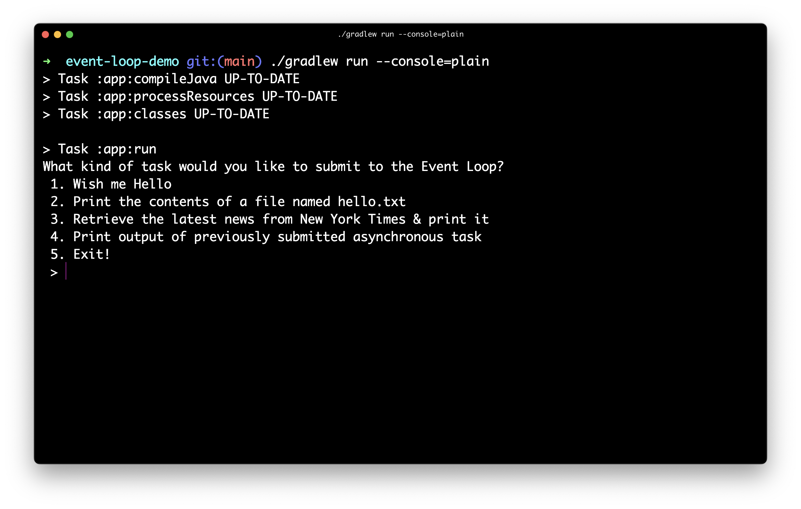

Next, let's select the first task (`"Wish me Hello"`):

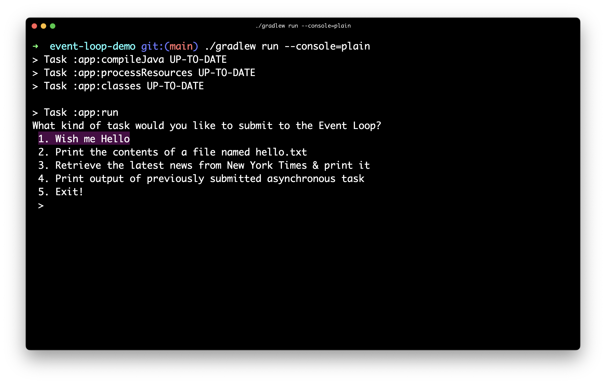

Now, let's tell our `EventLoop` to execute it `synchronously`:

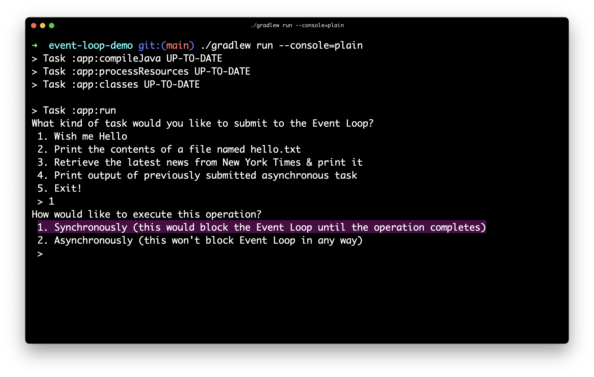

The results:

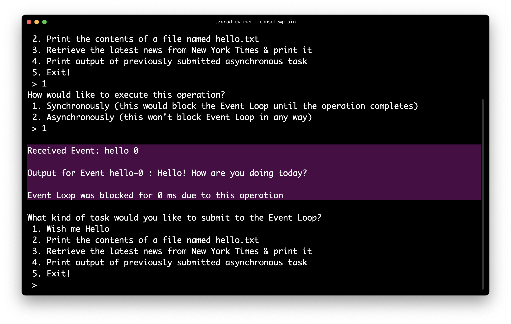

As we can see from the above screenshot, executing the first task synchronously blocked the `EventLoop` for about **0 ms**.
Also, notice that a unique id has been assigned to the event generated for this task: `hello-0`

Next, let's choose the second task (`"Print the contents of a file named hello.txt"`):

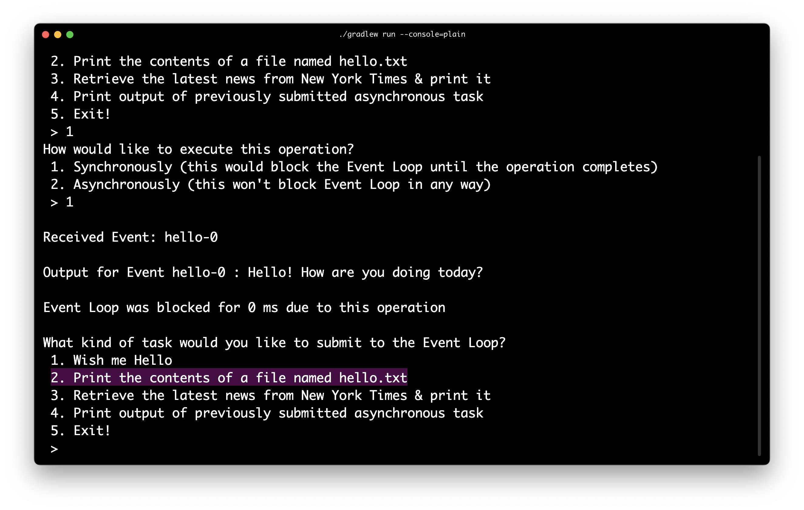

Let's tell our `EventLoop` to execute it `synchronously`:

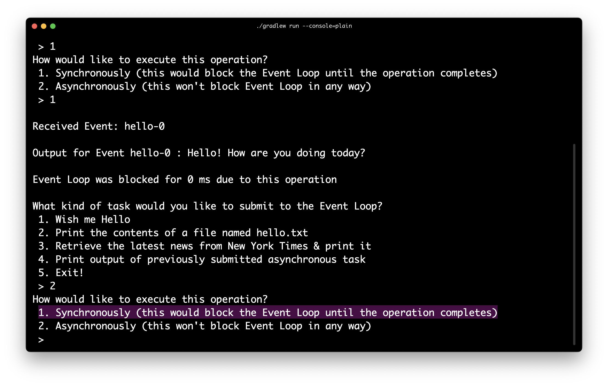

The results:

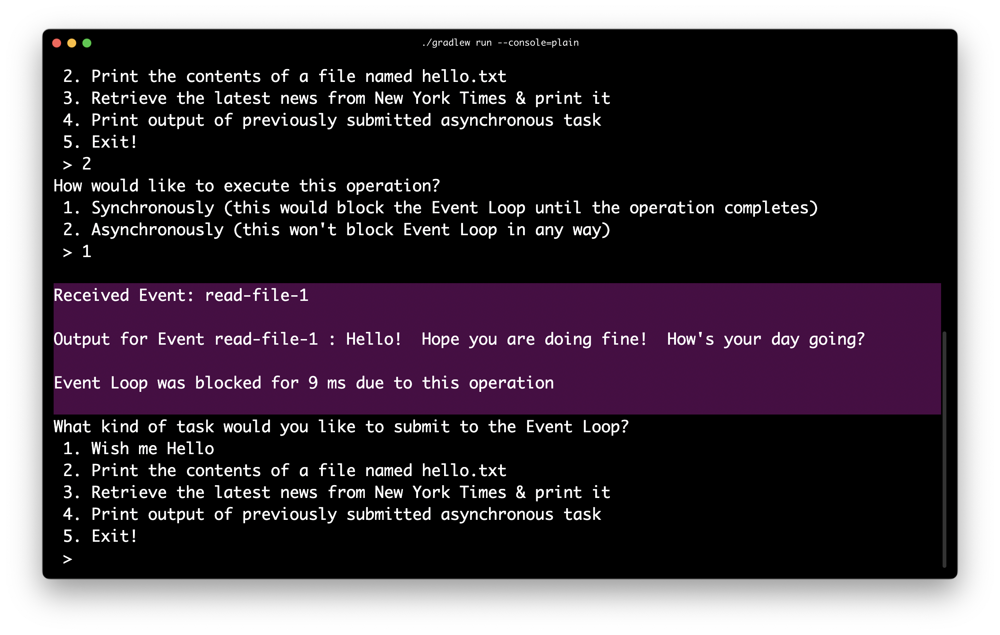

As we can see from the above screenshot, executing the second task synchronously blocked the `EventLoop` for about **9 ms** or **0.009 seconds**, and the unique id that's assigned to its event is `read-file-1`.

Next, let's choose the third task (`"Retrieve the latest news from New York Times & print it"`):

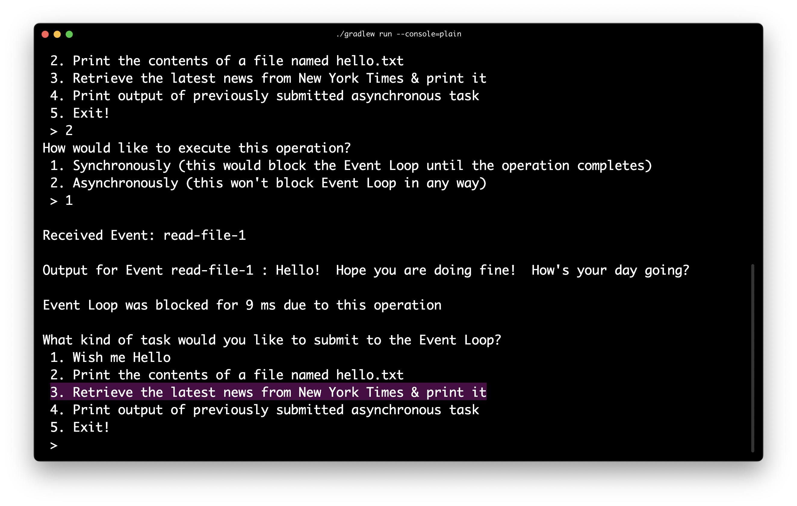

As with the other two tasks, we again instruct our `EventLoop` to execute it `synchronously`:

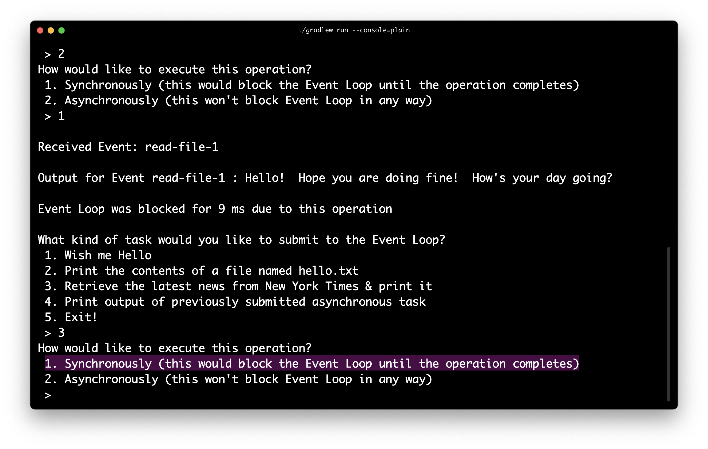

The results:

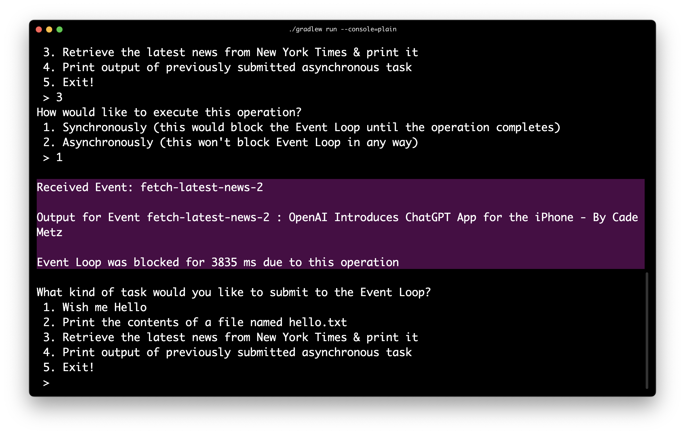

As we can see from the above screenshot, executing the event with id `fetch-latest-news-2` synchronously blocked the `EventLoop` for about **3835 ms** or **3.8 seconds.**

So, it seems printing a simple message on the screen takes the smallest amount of time whereas fetching data from the Internet takes the longest!

Now, let's make one small change to the tasks that took more than **0 ms:** to execute: let's switch the execution mode of these tasks to `asynchronous`.

Let's do this for the second task: `"Print the contents of a file named hello.txt"`

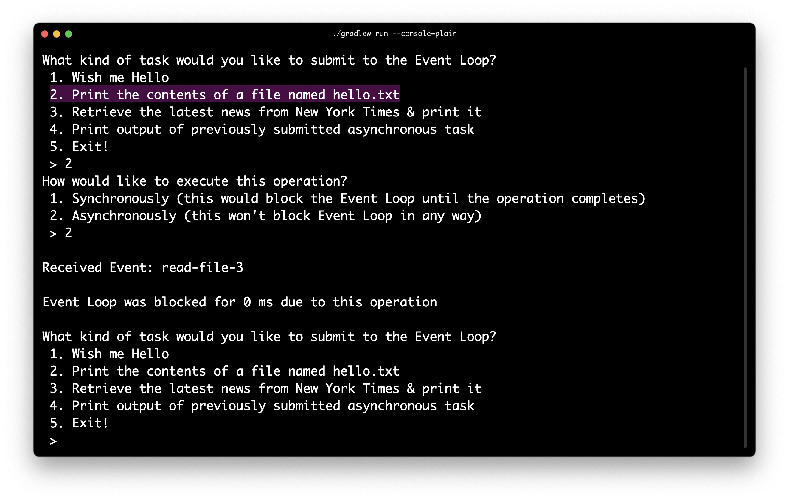

As we can see in the above screenshot, the `EventLoop` was blocked for **0 ms** this time! Also, notice that this time the event id has changed to `read-file-3`.

But wait, where's the output of the task?

Here's the catch: since the `main` thread delegated the task to a `worker` thread, it won't have access to the output until the  `worker` thread finishes its execution.

So, how will the `main` thread come to know that the `worker` thread has finished the execution of the task?

It will have to check the list of `processedEvents` and look for the results stored against the unique id of the event generated for this task: `read-file-3`

But in order to do this, the `EventLoop` will have to execute another iteration.

But how will it execute another iteration if it's waiting for the user to give it another task?

Well, it won't!

We'll have to give it a special task (`"Print output of previously submitted asynchronous task"`) so that it is forced to execute another iteration and, in the process, picks up the result of the previous task.

This is what it looks like:

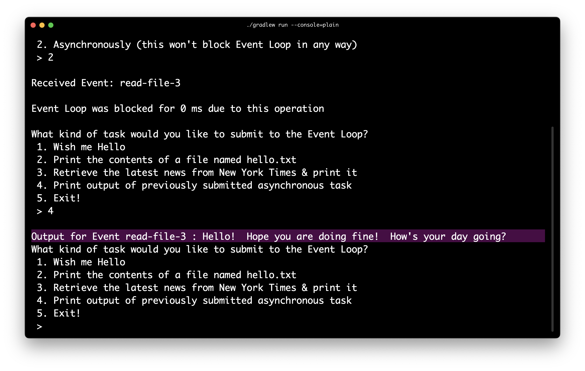

That's it, folks!

I hope you found this exercise as useful as I did.

In case anyone wants to fiddle around with the code, feel free to fork the following repo:

[https://github.com/pratikgchaudhari/event-loop-demo](https://github.com/pratikgchaudhari/event-loop-demo)
